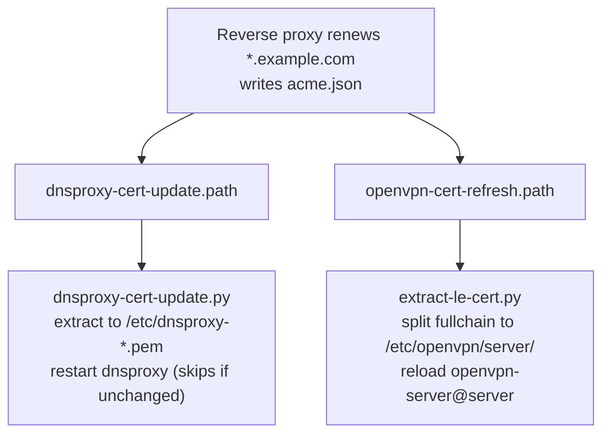

<div align="center">

# homelab-network

**The network under a self-hosted security homelab: one inbound port, a self-fanning wildcard cert, self-hosted DNS, and router-side failover.**

[Why](#why-it-is-shaped-this-way) · [At a glance](#at-a-glance) · [Deploy](#deploy) · [Part of NoxLab ↗](https://github.com/FabulaNox/NoxLab)

[](LICENSE)

</div>

---

The network underneath a self-hosted security homelab: **one inbound port**, a
single wildcard certificate that **fans itself out** to every TLS consumer,
**self-hosted DNS** (Unbound + DoH) with detection-driven blocklisting, and a
**router-side failover** so the LAN keeps working internet even when the box
that runs DNS is down.

The guiding rule came before any of the implementation: **nothing inbound**. The
whole shape of the network falls out of refusing to forward a port to the open
internet - one VPN port in, and public services that *dial out* over a tunnel
instead of opening anything.


## Contents

- [Why it is shaped this way](#why-it-is-shaped-this-way)
- [At a glance](#at-a-glance)
- [Segments](#segments)
- [Ingress - two paths, neither a wide-open port](#ingress---two-paths-neither-a-wide-open-port)
- [Certificates - one wildcard, auto-fanned out](#certificates---one-wildcard-auto-fanned-out)
- [DNS - two layers, self-hosted](#dns---two-layers-self-hosted)
- [DNS failover - on the router, not the box that fails](#dns-failover---on-the-router-not-the-box-that-fails)
- [Egress - controlled boundaries, not blanket controls](#egress---controlled-boundaries-not-blanket-controls)
- [Monitoring fan-in](#monitoring-fan-in)
- [What's here](#whats-here)
- [Deploy](#deploy)
- [Maintain](#maintain)
- [Gotchas](#gotchas)
  - [The port was already taken - by something I did not know was listening](#the-port-was-already-taken---by-something-i-did-not-know-was-listening)
- [Screenshots](#screenshots)

---

## Why it is shaped this way

**Nothing inbound, by rule, from day one.** The usual advice is to forward a port
and firewall it down. My answer is: why not just leave port 22 open to the
internet while you are at it? A forwarded-and-hardened port is still a port on
the public internet waiting to be wrong. So there is exactly one inbound NAT (the
VPN listener), and the handful of services I publish reach the world through an
**outbound-initiated tunnel** - the tunnel daemon dials out, nothing dials in, so
there is **zero inbound surface** for them.

That tunnel is a deliberate trade, not a free lunch: it puts a third-party
provider in the path for the few public pages. I take it with eyes open - I
already trust my ISP with every packet that leaves the house. The privacy half of
that worry (what my ISP sees of my *DNS*) is handled separately, by running my
own resolver with DoH.

**Self-hosted DNS, on purpose.** The easy path is to point everything at the
router or at `1.1.1.1` and forget it. I run my own resolver for two reasons:
learning (you only understand DNS by operating it), and not handing my ISP a log
of everywhere I go.

## At a glance

| | |
|---|---|
| **Ingress** | One inbound port (the VPN). Public services use an outbound-only tunnel - zero inbound surface. |
| **TLS** | One wildcard cert, DNS-01 renewal (no inbound :80), auto-fanned out to every consumer. |
| **DNS** | Self-hosted Unbound (recursive, blocklisting) + a DoH frontend, on loopback aliases. |
| **Resilience** | If the core resolver dies, the edge router fails LAN DNS over to public resolvers and reverts on recovery. |
| **Monitoring** | Host, network, and perimeter telemetry all fan into the SIEM. |

## Segments

Trust is split across segments that match how exposed each is. Addresses use
RFC 5737 documentation ranges - they show the structure, not the real allocations.

| Segment | Range | Holds | Trust |
|---|---|---|---|
| Management LAN | `192.0.2.0/24` | Core server (`.10`), router (`.1`), workstation, laptops, **and the VMs (bridged)** | Highest - wired, local |
| VPN clients | `198.51.100.0/24` | Authenticated remote devices | Medium - remote, authed |
| Docker bridges | `203.0.113.0/24` | Per-tier isolated container networks on the core | Scoped per tier |

Docker bridges are isolated per platform tier rather than sharing one flat
network, so a container in the app tier cannot reach the Git/CI tier laterally.
See [homelab-docker-platform](https://github.com/FabulaNox/homelab-docker-platform)
for the tiering itself; this repo is the network around it.

## Ingress - two paths, neither a wide-open port

A single reverse proxy (Traefik) terminates all inbound TLS with the wildcard
ACME cert. External reachability uses two deliberate paths, and **no general
inbound port is ever opened**:

1. **VPN (the only inbound NAT).** The edge firewall forwards exactly one WAN
   port - the VPN listener ([`vpn/server.conf`](vpn/server.conf)). Once on the
   tunnel you are on the LAN. Sensitive services (the forge, dashboards) sit
   behind allowlist middleware restricting them to LAN + VPN ranges, so they are
   unreachable from the open internet even though the proxy is internet-adjacent.
2. **Outbound tunnel for public services.** Select services are published through
   an outbound-initiated tunnel - reachable publicly with **zero inbound ports**
   and no port-forwarding.

Admin SSH is key-only, on per-host non-default ports.

## Certificates - one wildcard, auto-fanned out

All TLS in the lab is a single **wildcard certificate** (`*.example.com`). The
reverse proxy obtains and auto-renews it with a **DNS-01 challenge** (proving
control through the DNS provider's API), so renewal needs **no inbound port 80** -
which matters, because the lab opens no HTTP port to the internet at all.

The catch: the VPN server and the DoH resolver also need that cert, and neither
sits behind the proxy. Rather than give each its own ACME client, the renewal is
**fanned out** - when the proxy rewrites `acme.json`, two **systemd path watchers**
notice and run small extract-and-reload scripts:



One renewal keeps every TLS consumer current, with zero manual steps. The
extractors are idempotent: a path watcher can fire on a write that did not change
the cert, so [`dnsproxy-cert-update.py`](certs/dnsproxy-cert-update.py) hashes
before it restarts. VPN client profiles embed the **CA chain**, not the server
cert, so they keep working across renewals - they only need reissuing if the VPN's
own PKI changes. The units live in [`certs/systemd/`](certs/systemd/).


*DoH answering over the wildcard cert: the `TLS session (TLS1.3)` and `HTTP session (HTTP/2-POST)…/dns-query` lines are the proof - kdig validates against the system CA store and would refuse a self-signed cert.*

## DNS - two layers, self-hosted

On the core server ([`dns/`](dns/)):

- **Unbound** - recursive resolver for LAN, VPN, and containers, with query
  logging shipped to the SIEM ([`dns/unbound/`](dns/unbound/)).
- **dnsproxy** - a DoH frontend on `:8053` for clients that want encrypted
  resolution, forwarding plaintext to Unbound on localhost
  ([`dns/dnsproxy.service`](dns/dnsproxy.service)).

**Split-horizon:** internal names resolve to internal addresses
([`local-zones.conf`](dns/unbound/local-zones.conf)), so the same hostname works
on-LAN and over VPN without exposing anything publicly. Adding an internal service
is one `local-data` line - the wildcard cert already covers it.

Resolver endpoints are **loopback aliases** on the host (`127.0.0.10` etc.),
decoupled from any single NIC, so DNS survives reboots and link changes. The
aliases are set up before Docker/DNS start by the
[net-topology step](https://github.com/FabulaNox/homelab-docker-platform) in the
platform repo.

**Blocklisting is detection-driven.** A SIEM finding showed internal hosts
following reverse-DNS (PTR) delegations out to an unfamiliar nameserver during
routine traffic. The fix pins those delegating zones - and the forward name they
point at - to `NXDOMAIN` so the resolver never walks the referral. That is
hardening straight out of a triaged alert, not a guess.

## DNS failover - on the router, not the box that fails

Self-hosting DNS creates a single point of failure: LAN clients point at the
core's resolver, so if the core is down the LAN loses name resolution and, in
practice, the internet with it. A maintenance reboot that left the core half-up
made that risk concrete rather than theoretical.

The fix deliberately lives on the **edge router** - failover has to run on
something *other* than the box that fails ([`router/dns-failover.rsc`](router/dns-failover.rsc)).
The router (RouterOS Netwatch) probes the core's DoH listener every 30s and drives
a simple up/down state machine:

- **Down** - the instant the listener stops answering, the router repoints LAN
  DNS at two public resolvers (Quad9 + Cloudflare). Degraded mode loses local
  names and the core's filtering, but the LAN **keeps working internet** ("do no
  harm").
- **Up (auto-revert)** - once the probe sees the listener healthy again, the
  router hands DNS back to the core, behind a short debounce so a flapping reboot
  cannot yank it back and forth.

The probe is a **bare TCP connection** to the port live DoH already uses, so it
needs no DNS itself to run and adds no new traffic pattern. A DNS-server change on
a router is also a textbook hijack indicator, so each failover logs a loud marker
the SIEM alerts on:

```
# core goes down mid-reboot:
warning DNS-FAILOVER-DOWN core:8053 unreachable; LAN DNS -> public 9.9.9.9,1.1.1.1
# ... LAN still resolves via Quad9/Cloudflare throughout ...
# core comes back, 10s debounce, then:
warning DNS-FAILOVER-UP core:8053 healthy; LAN DNS -> core DoH restored
```


*The failover, caught and pushed in real time: the SIEM treats a router DNS-server change as a hijack indicator, so the failover both protects the LAN and raises an alert. ACTIVATED on the way down, CLEARED on recovery.*

Because the failover is autonomous and on an independent device, the core can
fail, flap, or sit broken and the LAN is protected regardless.

## Egress - controlled boundaries, not blanket controls

Outbound is treated as carefully as inbound. The worked example is the CI
platform's two runners: an **internal** runner that is DNS-gapped and runs
untrusted build/test jobs, and an **external** runner that has egress and runs
only the credentialed publish step. Routed by tag, so untrusted build steps never
share an egress path with the publish step. The only component with general egress
is the one narrow step that needs it. See
[gitlab-secure-publish](https://github.com/FabulaNox/gitlab-secure-publish).

## Monitoring fan-in

Telemetry converges on the SIEM VM: endpoint agents on the core and clients, the
**edge router shipping syslog** (custom decoders for router events, including the
failover markers above), and **Suricata** on the core feeding network IDS alerts.
One pane sees host, network, and perimeter events. Detail in
[wazuh-suricata-soc](https://github.com/FabulaNox/wazuh-suricata-soc).

## What's here

```
dns/
  unbound/
    local.conf             listener + per-segment access-control
    local-zones.conf       split-horizon records + detection-driven blocklist
    logging.conf           query/reply logging (shipped to the SIEM)
    remote-control.conf    local unbound-control socket
  dnsproxy.service         DoH frontend unit (:8053 -> Unbound :53)
vpn/
  server.conf              OpenVPN server - the single inbound path
certs/
  extract-le-cert.py       acme.json -> OpenVPN cert/key/chain
  dnsproxy-cert-update.py  acme.json -> dnsproxy cert/key (hash-gated restart)
  systemd/                 the two path watchers + their oneshot services
router/
  dns-failover.rsc         RouterOS Netwatch probe + up/down DNS scripts
assets/                    topology.svg + redacted-screenshot slots
```

## Deploy

DNS (on the core):

```bash
# 1. take systemd-resolved off port 53 first (see Gotchas), then:
sudo cp dns/unbound/*.conf /etc/unbound/unbound.conf.d/
sudo systemctl restart unbound
sudo cp dns/dnsproxy.service /etc/systemd/system/
sudo systemctl enable --now dnsproxy
```

Cert fan-out (on the core):

```bash
sudo install -m 0755 certs/*.py /usr/local/sbin/
sudo cp certs/systemd/* /etc/systemd/system/
sudo systemctl enable --now dnsproxy-cert-update.path openvpn-cert-refresh.path
```

VPN: drop [`vpn/server.conf`](vpn/server.conf) at `/etc/openvpn/server/server.conf`
(with its own VPN CA/CRL/DH), forward the one UDP port on the edge firewall, and
`systemctl enable --now openvpn-server@server`.

Failover: paste [`router/dns-failover.rsc`](router/dns-failover.rsc) into the
RouterOS terminal (or `/import`), adjusting addresses to your LAN.

## Maintain

Renewals are hands-off - the path watchers do it. To verify after a renewal, or
to recover if a watcher did not fire:

```console
$ sudo /usr/local/sbin/extract-le-cert.py
subject=CN = example.com
notBefore=May  5 00:00:00 2026 GMT
notAfter=Aug  3 23:59:59 2026 GMT
Extracted OK
  cert  -> /etc/openvpn/server/le-server.crt
  key   -> /etc/openvpn/server/le-server.key
  chain -> /etc/openvpn/server/le-chain.crt

$ sudo /usr/local/sbin/dnsproxy-cert-update.py
cert unchanged, nothing to do
```

If the watchers ever show `failed` after a path migration:

```bash
sudo systemctl reset-failed dnsproxy-cert-update.service openvpn-cert-refresh.service
sudo systemctl restart dnsproxy-cert-update.path openvpn-cert-refresh.path
```

Confirm DoH is serving over a valid cert (not the self-signed fallback):

```console
$ kdig -d @dns.example.com +https=/dns-query example.com
;; TLS session (TLS1.3)-(ECDHE-X25519)-(RSA-PSS-RSAE-SHA256)-(AES-256-GCM)
;; HTTP session (HTTP/2-POST)-(dns.example.com/dns-query)
;; ANSWER SECTION:
example.com.   	3600	IN	A	192.0.2.10
```

## Gotchas

### The port was already taken - by something I did not know was listening

**Symptom.** Standing up my own resolver, it would not start: the bind on port 53
failed. Nothing else I had installed was a DNS server, so the port should have
been free.

**Root cause.** `systemd-resolved` ships with a **stub listener** on
`127.0.0.53:53` by default, and it had quietly been the box's resolver all along -
`/etc/resolv.conf` pointed at it. Port 53 was occupied by a service I had never
consciously configured; my resolver and the stub were fighting over the same
socket.

**Fix.** Take the stub off the port, then hand DNS to my own resolver:

```ini
# /etc/systemd/resolved.conf
DNSStubListener=no
```

then point `/etc/resolv.conf` at the resolver's own (loopback-alias) address
rather than `127.0.0.53`.

**Lesson.** "Nothing is listening" is an assumption, not a fact - check it
(`ss -tulpn`) before blaming your own config. On a modern systemd box, DNS is
already being handled by something whether you asked for it or not; self-hosting
means first *displacing* the default, not just adding a service next to it.

## Screenshots

Two are embedded above: the **DoH-over-valid-cert** query (under Certificates)
and the **DNS-failover alerts** (under DNS failover - the SIEM catching the
failover in real time, standing in for the Netwatch-red shot). Each is
hand-redacted, since the text sanitisation gate cannot scan image pixels. See
[`assets/README.md`](assets/README.md) for capture notes.

---

*Part of a self-hosted security homelab. Addresses use RFC 5737 documentation
ranges; hostnames, the domain, and ports are abstracted.*

## License

[MIT](LICENSE) - configs, scripts, and docs are free to adapt.
